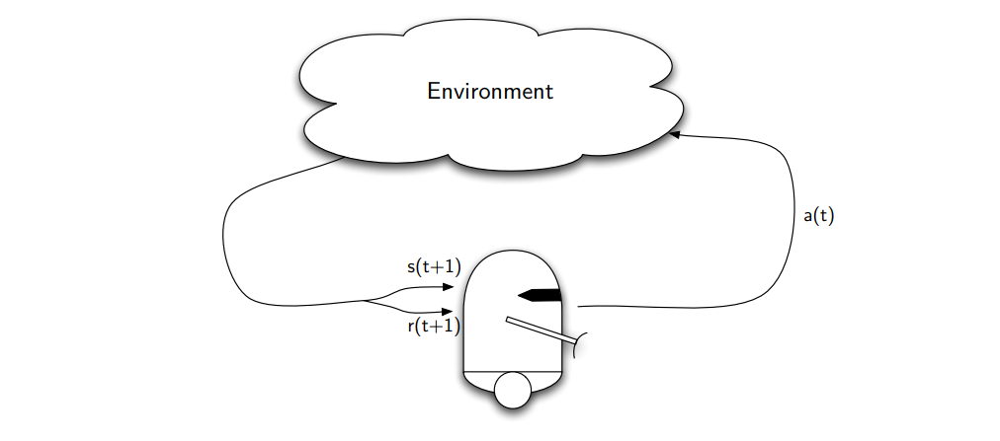
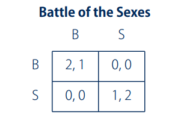

* 算法
* * Minimax-Q Learning  
  * Nash-Q Learning  
  * Other Equilibrium Learning Algorithms  
  * Policy Hill-Climbing  

# 单智能体强化学习

这本书，大神之作      Reinforcement Learning: An Introduction  

在交互中学习，主要目标是最大化奖励函数值

### 强化学习中的关键

* 没有人告诉学习者该采取什么行动
* 试凑方式
* 有可能延迟奖励（为了获得更长的收益而牺牲短的收益）
* 需要平衡exploration和exploitation
* 介于监督学习和非监督学习之间

### 智能体和环境之间的交互

观测状态$s_t$，被选择的行动$a_t$, 获得的及时奖励$r_{t+1}$, 观测到的结果状态$s_{t+1}$

### 强化学习的元素

* Action 可以是
* * 低的状态（电压或者电机的）
  * 高状态（向左或者向右）
  * “心理上”转移注意力

* State 可以是
* * 低电平(温度，$(t, v)$坐标)
  * 高级抽象，象征性
  * 主观的、内在的状态(“惊讶”、“失落”)

* 代理不一定知道环境
* State transitions（状态的改变)  可以是
* * 对代理内部状态的更改
  * 由于代理行为而引起的环境变化
  * 可以是不确定的

* Rewards  可以是
* * 目标、子目标
  * 持续
  * 目标函数

### 学习如何行为

* 从状态到行为概率的映射

  $π_t(s,a)=P(a_t=a|s_t=s)$

* 强化学习方法指定代理如何根据经验改变其策略
* 粗略地说，代理的目标是在长期内获得尽可能多的奖励

### 目标函数

假设每个时间序列$t$内的奖励为

$r_{t+1},t_{t+2}...$

* 目标函数就是最大化每个时间步长内奖励的期望$E(R_t)$

* Episodic tasks   会分成不同的时间段，总的奖励为：

$R_t=r_{t+1}+r_{t+2}+...+r_T$

* Continuing tasks   不会分成不同的时间段

### 统一的定义

* 可以想象在每一个时间段内结束与**absorbing state** (平衡状态，奖励值为零)

   

* 现在我们可以采用以下的公式得到奖励值：

## 马尔科夫链决策过程

* 通常假定所有相关信息都在当前状态下是有用的:马尔科夫特性

****

* 如果一个强化学习任务具有马尔可夫性质，那么它基本上就是一个马尔可夫决策过程(MDP)。

* 假设状态和作用空间是有限的，它是一个有限的MDP

  ### 一个马尔科夫链定义为

  * 状态和动作集**State and action sets**  
  * 由状态转移**transition probabilities**  概率定义的一步动力学

* * 回报几率**Reward probabilties**  

### 价值方程   Value functions  

* 当遵循固定策略π时，我们可以将该策略下的状态b的值定义为

* 同样，我们可以定义在状态下采取行动的价值b为

* 值函数具有特定的递归关系，由Bellman方程定义
* 

* 该方程表示了一个状态的值和它的后续状态之间的递归关系，并对所有的可能性进行平均，以每一种可能性的发生概率加权

### MDP的最优策略

* 我们想要找到使长期回报最大化的策略，这就等于找到最优价值函数

* 递归地表示，这就是Bellman**最优性方程**

### 解Bellman方程

* 我们可以通过求解Bellman方程找到最优策略

* * 动态规划**Dynamic Programming**  

- 两种方法：
- * 迭代改进值函数:值迭代**value iteration**  
  * 迭代评估和改进策略:策略迭代**policy iteration**  

* 证明了这两种方法都收敛于最优值函数

### 值迭代 **value iteration**  

### 策略迭代**policy iteration**  

* 通常最优策略在价值函数收敛之前就已经达到了
* 策略迭代基于当前值函数计算一个新的策略，然后基于此策略计算一个新的值函数
* 这一过程往往会更快地收敛到最优策略

## 在线学习最优策略

* 之前的两种方法都需要了解环境的动态
* 通常这方面的信息是无法获得的
* 采用时间差异(TD)方法是克服这一问题的一种方法：
* * 直接从原始的经验中学习
  * 不需要环境模型(无模型)
  * E.g.: Q-learning  

* 根据对即时奖励和后续状态的新观察，更新预测状态值

### Q-learning

* Q-learning基于即时回报和最优预期回报更新状态-行动值

* 直接学习最优值函数，而不依赖于所遵循的策略
* * In contrast to on-policy learners, e.g. SARSA  

* 证明了在每个状态-动作对有“充分”更新且学习率降低的情况下收敛于最优策略

### 行动选择**Action selection**  

* 如何根据状态或状态-动作对的值选择动作?
* RL的成功取决于权衡**trade-off**  
* * **Exploration**
  * **Exploitation**  

* 为了防止陷入局部最优，我们需要进行探索**Exploration**
* 为了确保您需要利用的收敛**Exploitation**  

**两种常见的选择**：

* 1. **$\epsilon$-greedy  **

* * 以概率1-$\epsilon$选择最佳的**action**
  * 以概率$\epsilon$选择随机的**action**

* 2. **Boltzmann exploration**  (softmax)使用温度参数**$\tau$**来平衡勘探和开发**exploration and exploitation**  

### 自动学习机 Learning automata  

* 学习自动机[Narendra74]直接根据观察到的奖励(策略迭代)修改策略
* 有限动作集学习自动机在有限动作集上学习策略

* 交叉学习**Cross learning**  是α = 1和β = 0的特例

### 学习自动机网络 Networks of learning automata

* 单个学习自动机忽略任何状态信息
* 在学习自动机的网络中[Wheeler86]，控制从一个自动机传递到另一个
* * 每个状态下都有一个自动机A处于活动状态
  * 即时奖励$r$“被替换为自上次状态的平均累计奖励$\overline{r}$

### 扩展

* 多步骤TD:合格性跟踪**eligibility traces**  
* * 与其只观察一个即时奖励，不如使用M个连续奖励来进行价值更新
  * 直觉:你现在的行动选择可能对未来有影响
  * 状态-行动组合有资格获得未来的奖励，最近的状态获得更多的奖励

* **Reward shaping**  
* * 在某一阶段（**episode**）结合领域知识以提供额外的奖励
  * 引导代理更快地学习
  * (最优)策略保留了一个基于潜力的塑造函数**shaping function**  [Ng99]

* 函数逼近
* * 到目前为止，我们对值函数使用了表格表示法
  * 对于大型状态和行动空间，这种方法变得难以处理
  * 函数逼近器可以推广到大的甚至连续的状态和行动空间

# 第二部分 多Agent增强学习  基础课程:博弈论基础

## 博弈论

* 将战略互动**strategic interactions**  作为游戏模型
* 在一般形式的游戏**normal form games**  中，所有玩家同时选择一个行动，他们的联合行动决定了他们的个人收益：
* * 只有一次的交互
  * 可以表示为$M$维收益矩阵，对于$M$个参与者

* 玩家的策略**strategy**  被定义为他可能采取的行动的概率分布

### 例子:囚徒困境

* 两个囚犯(A和B)一起犯罪
* 他们被单独审问，可以选择承认或否认
* * 1. 如果两人都认罪，两名囚犯将被判3年监禁
    2. 如果两人都否认，他们的轻微指控只服刑1年
    3. 如果只有一个人认罪，他就会被释放，而另一个人会被判5年

- 他们应怎样做
- 如果双方都否认，他们的总惩罚是最低的
- * 但就个人而言，这是理性的吗?

* 纯粹自私:不管其他玩家做什么，坦白是最佳选择
* * 1. 如果对方招供，3年而不是5年
    2. 如果对方拒绝，释放而不是1年

### 解决方案的概念

* 纳什均衡  **Nash equilibrium**  

* * 1. 人理性
    2. 没有一个玩家能够通过单方面改变自己的策略来提高自己
    3. 相互诚实**confession**  是这个博弈中唯一的纳什均衡

* 联合起来，玩家们可以做得更好

* * 1. 帕累托最优:没有其他的解决方案，所有的参与者都至少做得一样好，至少有一个人严格地更好
    2. 在这个博弈中，相互否认帕累托支配着纳什均衡,**即都不承认是帕累托最优解，但是两个人经过博弈之后，会选择都承认，因为都承认在个人角度是最好的，都不承认在整体上是最好的**

### 博弈的种类

* 1. 竞争或零和、

     * 玩家有相反的偏好

     * E.g. Matching Pennies  

       

  2. 对称信息博弈 Symmetric games  

     * 玩家都是相同的

     * 例如 囚徒困境

       

  3. 不对称信息博弈

     * 玩家是不同的
     * 例如：性别对战博弈

# 多Agent增强学习

### MARL: Motivation  动机

* MAS提供了一种能够处理复杂问题的解决范式
* 技术挑战需要分散的解决方案
* * 1. 用于勘探、监视或救援任务的多辆自动驾驶车辆
    2. 分布式传感器
    3. 交通管制(数据、城市或空中交通)

* 主要优点:容错和负载均衡
* 但是:存在高度动态和不确定性的环境!
* 学习是至关重要的!

### 从单智能体到多智能体学习

* 本质上更有挑战性
* 代理与环境和其他代理相互作用
* 学习是同时发生的
* 一个agent的策略改变可能会影响其他agent的策略
* 问题：
* * 1. 一个vs多个学习主体?
    2. 收敛？
    3. 目标函数:全部奖励最大化还是个人奖励最大化?
    4. 奖励如何分配？

## 独立强化学习

* 扩展到多代理agent设置

* 独立学习者相互忽视对方
* 在随机环境中，隐式感知与其他主体的交互作用为噪声

### 矩阵博弈中的学习

* 两个Q-learner在性别博弈中：
* * $\alpha=0.01$
  * Boltzmann exploration  $\tau=0.2$

* 他们只观察到眼前的回报
* 策略逐步完善

### 马尔科夫博弈论

* $n$个玩家博弈：$<n,S,A^1,...,A^n,R^1,...,R^n,P>$

* * $S$：状态集合
  * $A^i$：对于玩家$i$的行动集合
  * $R^i$：对于玩家$i$的回报
  * $P$：转换函数**transition function**  

* 回报方程$R^i$：$S\times A^1\times ... \times A^n \rightarrow R$  映射行为$a=<a^1...a^n>$到实时的回报值对于第$i$个玩家
* 转换矩阵$P:S \times A^1 \times ... \times A^n \rightarrow \Delta(S) $确定状态转换到下一个状态的概率$s_{t+1}$

### 马尔可夫对策中的值迭代

* 单个agent的MDP：

* 二人零和随机对策:

  

### Minimax-Q  

* 价值迭代需要关于奖励和过渡功能的知识
* Minimax-Z:零和博弈学习算法
* 回报平衡后，每个代理只需要观察自己的回报
* Q是一个联合行为方程：

联合行动学习者**joint action learner**  (JAL)是一种代理，它学习联合行动的Q值，而不是单个行动。

* 第$t$阶段奖励函数$R_t$的agent 1更新规则:

* 下一个状态的值 $V(s_{t+1})$:

* 在与正则Q-learning相同的假设下，Minimax-Q收敛于Nash均衡[Littman94]

### Nash-Q learning

* Nash-Q learning: 一般和随机对策的联合行动学习器
* 每个个体代理还必须估算所有其他代理的Q值
* 最优Nash-Q learning: 在所有行动者从下一阶段开始采取指定的纳什均衡的条件下，立即奖励和贴现未来奖励的总和

* 对于智能体agent$i$更新规则:

* 对每个阶段的博弈计算一个纳什均衡 $(Q^1_t(s_{t+1},.),...,Q_t^n(s_{t+1},.))$而且结果对于agent$i$存在纳什均衡回报$Nash V_t^i(s_{t+1},.)$
* agent $i$ 使用相同的规则去评估其他agent的Q值，$Q^j \forall j \in \frac {\left\{1,..,n \right\}} {i}$

### 其他均衡学习算法

### MARL 的限制

* 收敛保证主要局限于无状态重复博弈

* 或不适用于一般和博弈**general-sum games**  

* 许多收敛证明对先验知识和/或可观测性有很强的假设

* 平衡学习者关注阶段解决方案(仅是间接状态耦合)

  

## 总结

* 在多智能体系统中：
* * 1. 注意代理可以获得哪些信息
    2. 如果你有能力尝试，只要运行一个符合假设的算法
    3. 收敛性的证明可用于Small games 小的博弈中
    4. 新的研究可以专注于工程解决方案，或者推进最先进的理论

# 在策略交互中学习的动态 Dynamics of Learning in Strategic Interactions

## 动态环境中的行动值

* 行动值是通过从与环境的交互中取样来估计的，可能是在其他代理存在的情况下。

* 动态系统的优点：
* * 1. 确定性的
    2. 使用雅可比矩阵保证收敛
    3. 大量相关文献(如分岔理论)

* 动力学已经被导出
* * 1. 学习自动机(交叉学习) Learning Automata (Cross Learning)  
    2. 后悔匹配(RM)   Regret Matching (RM)  
    3. 无穷小梯度上升的变化 Variations of Infinitesimal Gradient Ascent  
       * 无穷小梯度上升(IGA) Infinitesimal Gradient Ascent (IGA)  
       * Win-or-Learn-Fast (WoLF) IGA  
       * 加权策略学习 Weighted Policy Learning (WPL)  
    4. Q-learning的变化
       * 重复更新Q-learning
       * 频繁调整Q-learning

### 说明收敛

